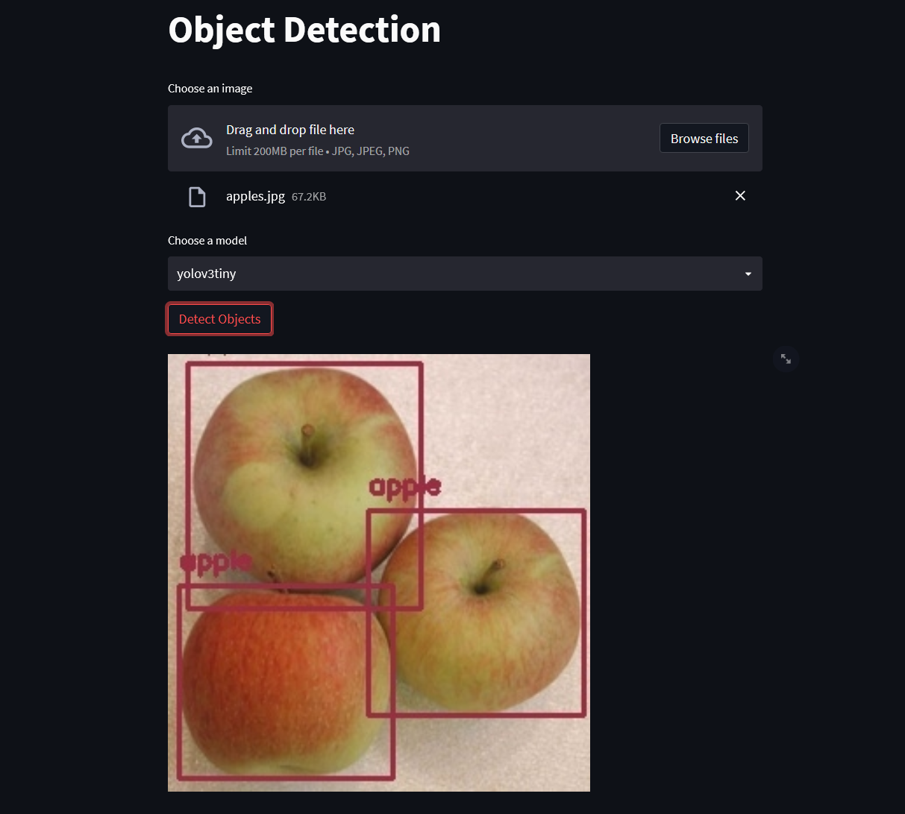

## Object Detection with Yolo v3
A web app to examine the capabilities of object detection in images with the
[Yolo v3 model](https://pjreddie.com/darknet/yolo/) which is performance optimized for real time detection.

The frontend is build with Streamlit and sends requests for object detection to a FastAPI backend.

